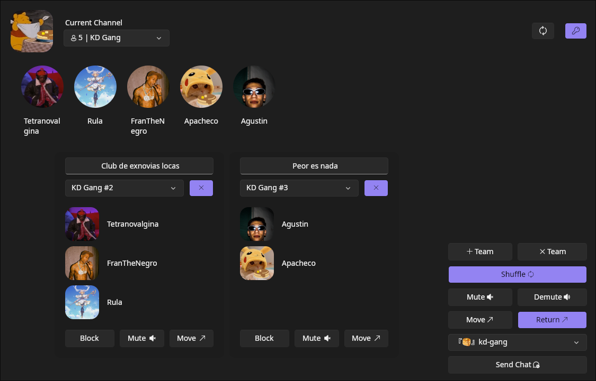
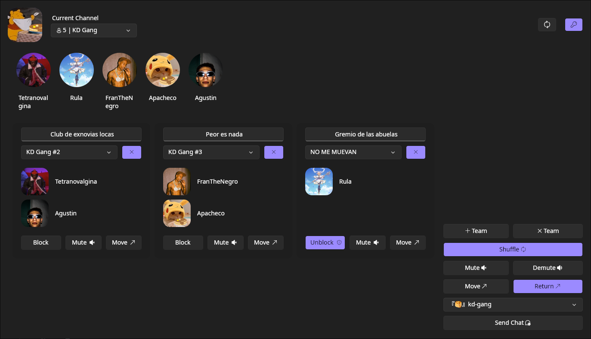
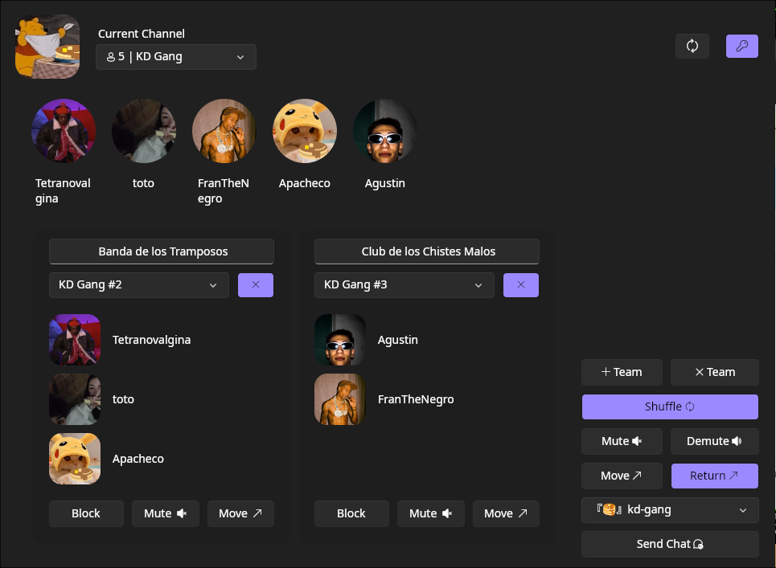
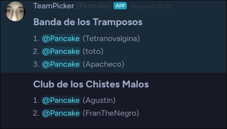

___
# Discord Team Generator

| :exclamation:  Im too Lazy :p  |
> This project aims to be a short, lazy effort. Minor issues will not be addressed, and the solution will be approached in the laziest manner possible.

This is an Avalonia-based program that automatically generates teams on Discord using the Discord API.

## Requirements

- **Discord Bot**: You need to have a Discord bot set up on your server with the necessary permissions to create roles and text/voice channels. You can obtain a token for your bot from the Discord developer portal.

## Screenshots









## Contributions

Contributions are welcome! If you want to improve this program, please create a pull request explaining your changes.

| :point_up:  This is very important   |
> **Note:** Make sure to keep your bot token secure and do not share it publicly.

### And now, a poem:
```
In the realm of digital dreams,
Where ideas flow like a lively stream,
A tool emerged with a clever scheme,
Crafting units from the coding seam.

Behold the wizard, the team picker,
With its magic, no need to bicker,
For it selects with a gentle flicker,
Assembling squads, each a beaming flicker.

Gathered together in a vibrant beam,
A fusion of talents, a dazzling gleam,
Bound by purpose, a shared regime,
In this world spun by the team picker's theme.

So let us toast to this software theme,
Where aspirations meld and dreams redeem,
In this world of bytes and pixels agleam,
Guided by the magic of the team picker's scheme.
```
___